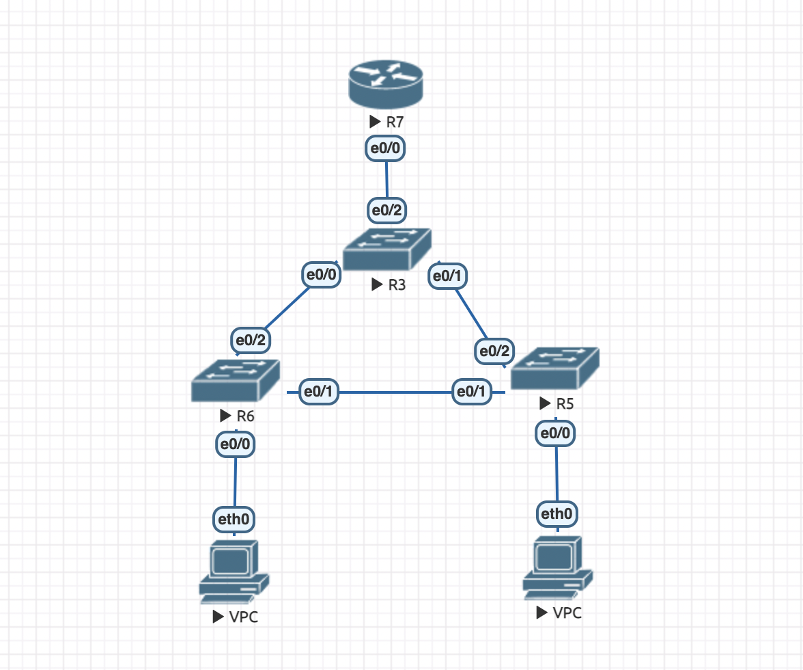
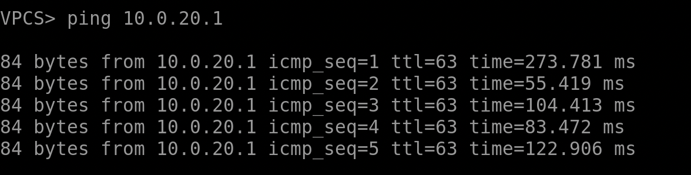
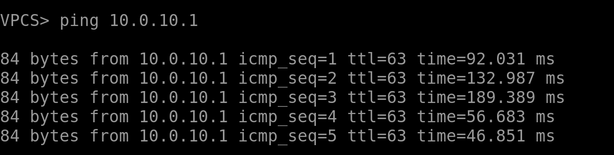

# lab 1
The work was done in EVE-NG using Cisco.

The following configuration was built:

Ping left VPC (vlan 10):

Ping right VPC (vlan 20):

The network is based on the STP protocol (in particular, rapid PVST was selected). The distribution layer switch is the network root for both VLANs. The link between the access layer switches is blocked.

In the src folder you can find the lab file (in .unl format) as well as configurations from network devices.
