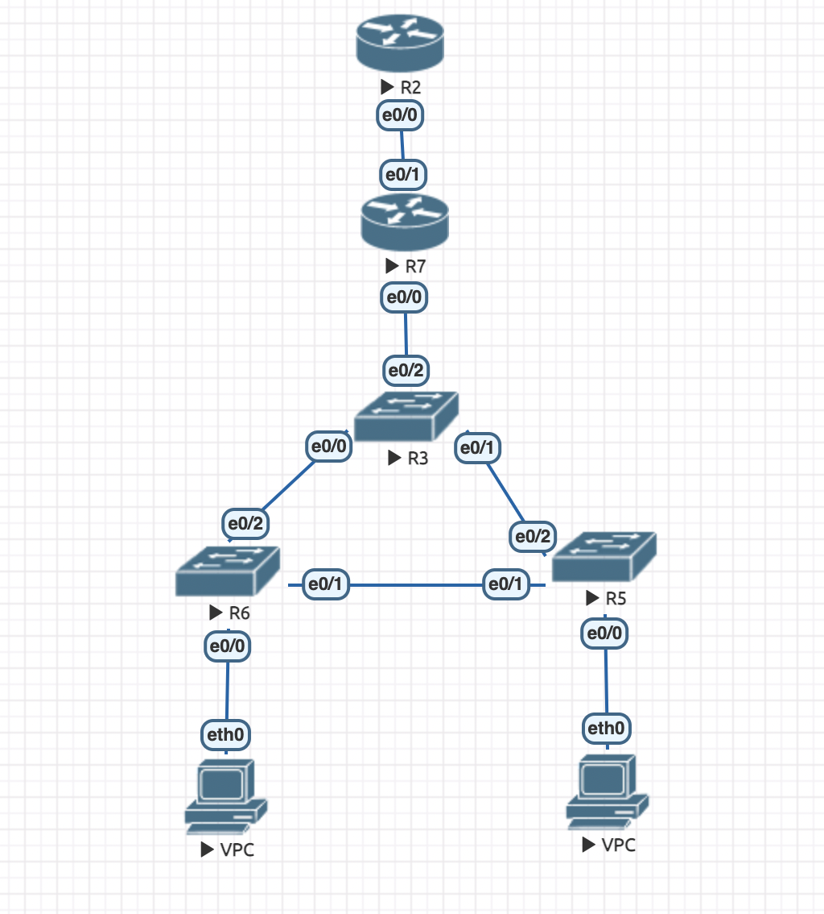

# UPD
Исправлены недочёты: динамическая раздача адресов NAT на роутере R7 была изменена на статическую (many to one nat):
```
ip nat inside source list 1 interface Ethernet0/1 overload
```
Соответственно были обновлены файлы lab3.unl и R7.txt. Также картинки для эстетичности были заменены на вставки кода.

# lab 3
Работа выполнена в EVE-NG с использованием Cisco.

Была построена конфигурация следующего вида:


Сохранено из lab1:
В сети настроен протокол STP (в частности, выбран был rapid PVST). Коммутатор уровня распределения является корнем сети для обоих VLAN. Линк между коммутаторами уровня доступа заблокирован.

Добавлено:
 1) Все клиенты получают сетевые настройки по DHCP.
 2) Первые 10 IP аддресов исключены из выдачи клиентам.
 3) Настроена NAT: клиенты могут обращаться к верхнему маршрутизатору (R2, ip address: 172.16.0.2) и получать ответ. При этом в R2 нет дополнительных маршрутов в локальную сеть.

Выводы с левого VPC:
  1) Запросили настройки по DHCP.
  2) Проверили, что можно пингануть правого VPC (и получить ответ).
  3) Проверили, что можем пингануть верхний маршрутизатор (и получить ответ).
```
VPCS> ip dhcp
DDORA IP 10.0.10.11/24 GW 10.0.10.2

VPCS> ping 10.0.20.11

84 bytes from 10.0.20.11 icmp_seq=1 ttl=63 time=384.129 ms
84 bytes from 10.0.20.11 icmp_seq=2 ttl=63 time=325.861 ms
84 bytes from 10.0.20.11 icmp_seq=3 ttl=63 time=105.507 ms
84 bytes from 10.0.20.11 icmp_seq=4 ttl=63 time=286.043 ms
84 bytes from 10.0.20.11 icmp_seq=5 ttl=63 time=116.598 ms

VPCS> ping 172.16.0.2

84 bytes from 172.16.0.2 icmp_seq=1 ttl=254 time=316.401 ms
84 bytes from 172.16.0.2 icmp_seq=2 ttl=254 time=107.171 ms
84 bytes from 172.16.0.2 icmp_seq=3 ttl=254 time=57.357 ms
84 bytes from 172.16.0.2 icmp_seq=4 ttl=254 time=81.532 ms
84 bytes from 172.16.0.2 icmp_seq=5 ttl=254 time=160.383 ms
```

Аналогичная ситуация для правого VPC:
  0) единственное отличие, что для первого пакета истёк timeout, просто предыдущий скрин был сделан после того, как левый VPC уже получил mac адрес верхнего маршрутизатора (были пинги до скрина). А для правого это был первый пинг, так что было дольше.
```
VPCS> ip dhcp
DDORA IP 10.0.20.11/24 GW 10.0.20.2

VPCS> ping 10.0.10.11

84 bytes from 10.0.10.11 icmp_seq=1 ttl=63 time=243.384 ms
84 bytes from 10.0.10.11 icmp_seq=2 ttl=63 time=80.859 ms
84 bytes from 10.0.10.11 icmp_seq=3 ttl=63 time=120.391 ms
84 bytes from 10.0.10.11 icmp_seq=4 ttl=63 time=107.002 ms
84 bytes from 10.0.10.11 icmp_seq=5 ttl=63 time=74.405 ms

VPCS> ping 172.16.0.2

84 bytes from 172.16.0.2 icmp_seq=1 ttl=254 time=190.699 ms
84 bytes from 172.16.0.2 icmp_seq=2 ttl=254 time=47.653 ms
84 bytes from 172.16.0.2 icmp_seq=3 ttl=254 time=75.394 ms
84 bytes from 172.16.0.2 icmp_seq=4 ttl=254 time=72.997 ms
84 bytes from 172.16.0.2 icmp_seq=5 ttl=254 time=96.615 ms
```

И последний вывод, демонстрирующий, что R2 не может отправлять пакеты клиентам сети.
```
Router#ping 10.0.10.1       
Type escape sequence to abort.
Sending 5, 100-byte ICMP Echos to 10.0.10.1, timeout is 2 seconds:
.....
Success rate is 0 percent (0/5)
```

В папке src можно найти фаул с лабораторной (в формате .unl), а также конфигурации с сетевых устройств.
