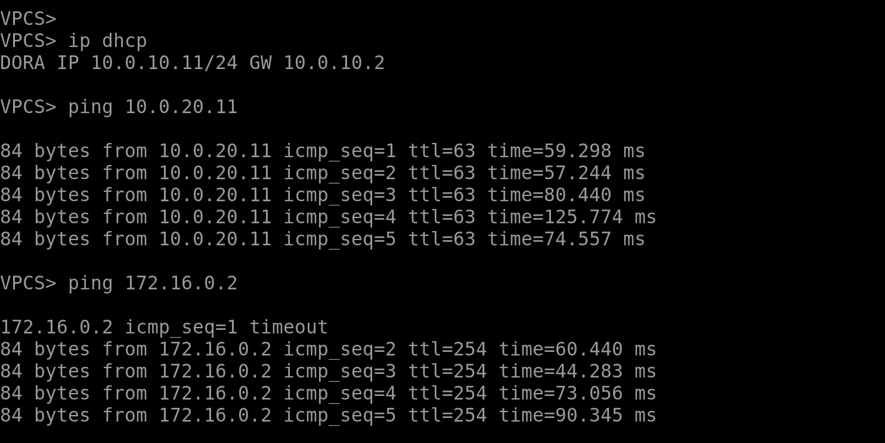
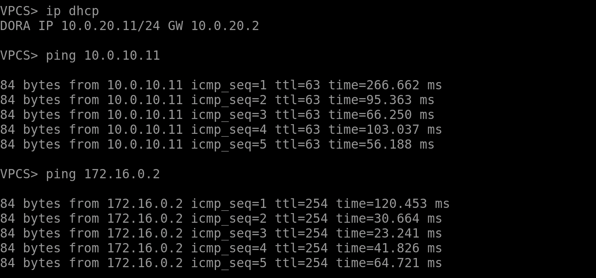
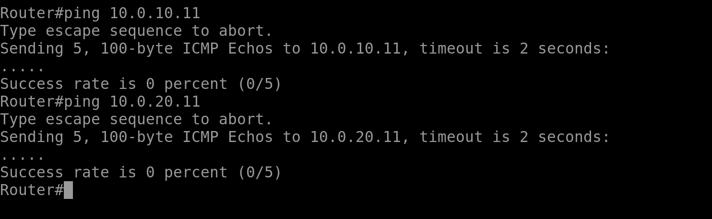

# lab 3
Работа выполнена в EVE-NG с использованием Cisco.

Была построена конфигурация следующего вида:

Сохранено из lab1:
В сети настроен протокол STP (в частности, выбран был rapid PVST). Коммутатор уровня распределения является корнем сети для обоих VLAN. Линк между коммутаторами уровня доступа заблокирован.

Добавлено:
 1) Все клиенты получают сетевые настройки по DHCP.
 2) Первые 10 IP аддресов исключены из выдачи клиентам.
 3) Настроена NAT: клиенты могут обращаться к верхнему маршрутизатору (R2, ip address: 172.16.0.2) и получать ответ. При этом в R2 нет дополнительных маршрутов в локальную сеть.

Выводы с левого VPC:
  1) Запросили настройки по DHCP.
  2) Проверили, что можно пингануть правого VPC (и получить ответ).
  3) Проверили, что можем пингануть верхний маршрутизатор (и получить ответ).

Аналогичная ситуация для правого VPC:
  0) единственное отличие, что для первого пакета истёк timeout, просто предыдущий скрин был сделан после того, как левый VPC уже получил mac адрес верхнего маршрутизатора (были пинги до скрина). А для правого это был первый пинг, так что было дольше.

И последняя картинка, демонстрирующая, что R2 не может отправлять пакеты клиентам сети.

В папке src можно найти фаул с лабораторной (в формате .unl), а также конфигурации с сетевых устройств.
