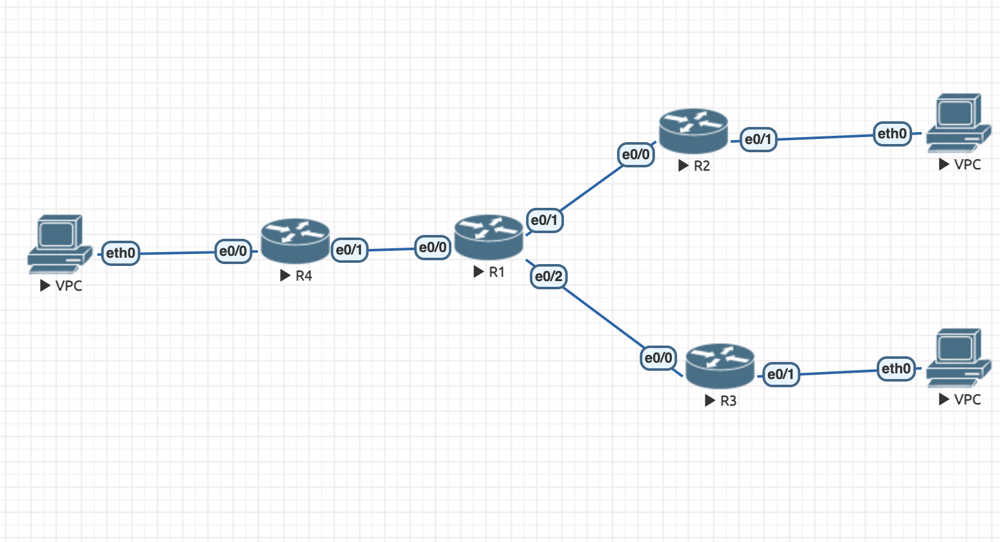

# lab 4
Работа выполнена в EVE-NG с использованием Cisco.

Была построена конфигурация следующего вида:


В топологии заданы 2 тунеля, R4 — R2 (GRE) и R4 — R3 (GRE + IPSEC). 
В каждом тунеле MTU = 1400, MSS = 1360. IPSec настроен с методом шифрования 3DES, алгоритмом шифрования MD5, протоколом DH.

Пинганём VPC2(10.0.20.2) c VPC1(10.0.10.2). Выведем trace, чтобы посмотреть, как пакеты добираются до VPC2:
```
VPCS> show ip

NAME        : VPCS[1]
IP/MASK     : 10.0.10.2/24
GATEWAY     : 10.0.10.1
DNS         : 
MAC         : 00:50:79:66:68:05
LPORT       : 20000
RHOST:PORT  : 127.0.0.1:30000
MTU         : 1500

VPCS> trace 10.0.20.2
trace to 10.0.20.2, 8 hops max, press Ctrl+C to stop
 1   10.0.10.1   52.010 ms  14.378 ms  8.759 ms
 2   172.16.0.2   51.129 ms  28.760 ms  42.916 ms
 3   *10.0.20.2   103.661 ms (ICMP type:3, code:3, Destination port unreachable)

VPCS> ping 10.0.20.2 

84 bytes from 10.0.20.2 icmp_seq=1 ttl=62 time=74.475 ms
84 bytes from 10.0.20.2 icmp_seq=2 ttl=62 time=38.418 ms
84 bytes from 10.0.20.2 icmp_seq=3 ttl=62 time=31.637 ms
84 bytes from 10.0.20.2 icmp_seq=4 ttl=62 time=29.568 ms
84 bytes from 10.0.20.2 icmp_seq=5 ttl=62 time=72.764 ms
```

Пинганём VPC3(10.0.30.2) c VPC1(10.0.10.2). Выведем trace, чтобы посмотреть, как пакеты добираются до VPC3:
```
VPCS> show ip        

NAME        : VPCS[1]
IP/MASK     : 10.0.10.2/24
GATEWAY     : 10.0.10.1
DNS         : 
MAC         : 00:50:79:66:68:05
LPORT       : 20000
RHOST:PORT  : 127.0.0.1:30000
MTU         : 1500

VPCS> trace 10.0.30.2
trace to 10.0.30.2, 8 hops max, press Ctrl+C to stop
 1   10.0.10.1   101.822 ms  12.100 ms  1.296 ms
 2   172.16.1.2   377.146 ms  35.237 ms  34.200 ms
 3   *10.0.30.2   269.617 ms (ICMP type:3, code:3, Destination port unreachable)

VPCS> ping 10.0.30.2 

84 bytes from 10.0.30.2 icmp_seq=1 ttl=62 time=62.751 ms
84 bytes from 10.0.30.2 icmp_seq=2 ttl=62 time=63.458 ms
84 bytes from 10.0.30.2 icmp_seq=3 ttl=62 time=38.254 ms
84 bytes from 10.0.30.2 icmp_seq=4 ttl=62 time=40.354 ms
84 bytes from 10.0.30.2 icmp_seq=5 ttl=62 time=44.646 ms
```

Рассмотрим параметры шифрования (вывод с R4) и убедимся, что оно работает:
```
Router#show crypto session
Crypto session current status

Interface: Tunnel1
Session status: UP-ACTIVE     
Peer: 10.0.3.1 port 500 
  Session ID: 0  
  IKEv1 SA: local 10.0.1.1/500 remote 10.0.3.1/500 Active 
  Session ID: 0  
  IKEv1 SA: local 10.0.1.1/500 remote 10.0.3.1/500 Active 
  IPSEC FLOW: permit 47 host 10.0.1.1 host 10.0.3.1 
        Active SAs: 2, origin: crypto map
```
В папке src можно найти фаул с лабораторной (в формате .unl), а также конфигурации с сетевых устройств.
